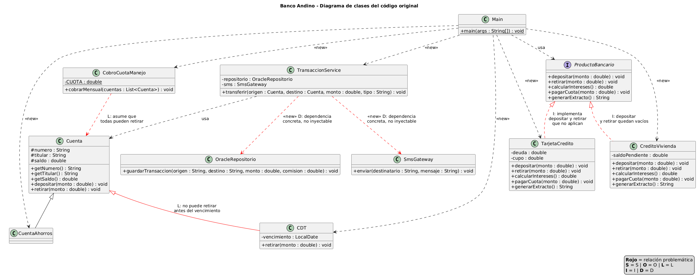
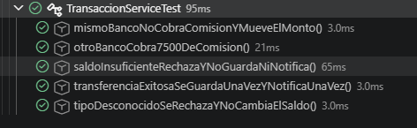

# Laboratorio_SOLID
Desarrollo del Laboratorio L2: SOLID , Taller integrador: el backend de Banco Andino

##  1.1 Tabla de hallazgos

| Clase / método| Letra| Evidencia en el código| Consecuencia para el banco o el cliente |
|---------------|------|-----------------------|-----------------------------------------|
| TransaccionService.transferir | S | Un solo método se encarga de validar, calcular la comisión, mover el dinero, guardar en Oracle, imprimir el comprobante, mandar el SMS y registrar la auditoría. | Si el área legal cambia el formato del comprobante o alguien cambia el texto del SMS, hay que abrir la misma clase que mueve la plata, donde un cambio cosmético puede terminar cobrando mal una transferencia. |
| TransaccionService.transferir | O | Hay un switch tipo con los casos MISMO_BANCO, OTRO_BANCO e INTERNACIONAL, por ello para agregar un tipo nuevo hay que editar ese método. | El banco no puede lanzar un tipo de transferencia nuevo sin modificar el servicio central, y cada cambio pone en riesgo los tipos que ya funcionaban. |
| TransaccionService (atributos) | D | La clase hace new OracleRepositorio() y new SmsGateway() por su cuenta, es decir que no hay interfaces ni forma de que le pasen otras implementaciones. | No se puede cambiar de motor de base de datos ni de proveedor de SMS sin editar el servicio y tampoco se puede probar, porque cada prueba se conecta a producción y le manda un SMS real al cliente. |
| CDT.retirar | L | CDT extiende Cuenta, pero su retirar lanza UnsupportedOperationException si el CDT no ha vencido. | Un CDT no se puede usar donde se espera una Cuenta, ya que si se cuela en una lista de cuentas, el programa falla en ejecución y no al compilar. |
| CobroCuotaManejo.cobrarMensual | L | Recibe una `List<Cuenta>` y llama cuenta.retirar(CUOTA) suponiendo que todas se pueden retirar. | Con un solo CDT en la lista, el cobro nocturno se detiene en esa cuenta y por tanto las anteriores ya quedaron cobradas, las siguientes nunca se cobran y no hay reversa. |
| ProductoBancario | I | Una sola interfaz con cinco métodos que son depositar, retirar, calcularIntereses, pagarCuota, generarExtracto y que se le exige a todos los productos. | Quien crea un producto nuevo queda obligado a implementar métodos que no tienen sentido para él, la interfaz promete cosas que algunos productos no pueden cumplir. | TarjetaCredito.retirar | L | En una cuenta retirar baja el saldo, pero en la tarjeta es un avance en efectivo y sube la deuda. | El mismo nombre significa cosas opuestas ya que el código genérico que use ProductoBancario puede hacer un movimiento contable al revés de lo que espera. |

##  1.2 Dos experimentos

### 1.2.1 El CDT

Agregamos cdtAna a la lista que recibe cobrarMensual en el Main:
`new CobroCuotaManejo().cobrarMensual(List.of(ana, luis, cdtAna));`

**Resultado observado** 

```text
Cuota de manejo cobrada a 001-1
Cuota de manejo cobrada a 001-2
Exception in thread "main" java.lang.UnsupportedOperationException: Un CDT no permite retiros antes del vencimiento
        at CDT.retirar(CDT.java:14)
        at CobroCuotaManejo.cobrarMensual(CobroCuotaManejo.java:8)
        at Main.main(Main.java:13)
```

**¿Qué pasa?** El programa se cae apenas llega al CDT. CobroCuotaManej recibe una `List<Cuenta>` y le llama retirar a cada elemento, asumiendo que todas las cuentas se comportan igual. Pero CDT sobrescribe retirar para bloquear el retiro antes del vencimiento y lanza una excepción, de esta manera nadie la captura, así que el hilo principal termina

**¿Qué pasaría en producción con un millón de cuentas y el CDT en la posición 500.000?**
Se cobrarían bien las primeras 499.999 cuentas, pero el proceso fallaría en el CDT y las 500.000 cuentas siguientes más el propio CDT y quedarían sin cobro, con esto tenemos las sigueintes consecuencias:

- El banco deja de recibir ese día aproximadamente la mitad de las cuotas de manejo.
- Como el proceso corre de noche el fallo se note hasta el día siguiente.
- No hay transacción ni reversa ya que el cobro queda a medias y hay que averiguar a mano hasta qué cuenta llegó.
- Reintentar el proceso completo cobraría otra vez a las primeras 499.999 cuentas y volvería a fallar en el mismo CDT y nunca llegaría a las demás.
- Cobrar con retraso a los clientes restantes podría traer reclamos y problemas con la contabilidad del banco.

### 1.2.2 La prueba imposible

**Resultado:** no logramos cumplir la condición ya que depués de revisar el código, concluimos que es imposible escribir una prueba de la comisión de $7.500 sin conectarse a Oracle y sin enviar un SMS.

**Qué lo impide:** la clase TransaccionService crea ella misma el OracleRepositorio y el SmsGateway con new y no hay ninguna forma de cambiarlos por versiones falsas desde afueram, por eso cualquier prueba de una transferencia termina conectándose a Oracle y mandando el SMS al cliente.

Además que aunque el cálculo de la comisión es lo único que queremos probar, está metido dentro del switch de transferir, así que no se puede probar por separado y el método no devuelve la comisión, entonces lo único que se puede revisar son efectos secundarios, como el saldo de la cuenta o lo que se imprime en consola y por ultimo también La auditoría imprime la fecha y hora actual directamente.

## 1.3 Medición "antes"

| Métrica | Antes |
|---|---|
| Líneas del método transferir | Se encontraon que son 36 contando desde la línea 7 hasta la 42, incluyendo comentarios, espacios y llaves de cierre, por esto podemos entender que este método de 36 líneas es difícil de leer y mantener, ya que existe una regla general para entender que no debería pasar de 10-15, en este caso no trata de complejidad sino porque hace demasiadas cosas distintas, después del refactor se esperaría que quedara en 5-8 líneas, delegando el cálculo de comisión, la persistencia y la notificación a otras clases. |
| Razones distintas por las que TransaccionService podría cambiar | Hay 7 razones  que se encontraron y son: validación del monto y tope diario, cálculo de comisión según tipo, movimiento del dinero, persistencia en Oracle, impresión del comprobante, envío de SMS y registro de auditoría. Cada una es una razón independiente para tocar la clase, ya que si cambia el formato del comprobante, la comisión internacional, el proveedor de SMS o el motor de base de datos, hay que modificar la misma clase y esto esta erroneo porque clase debería tener una sola razón para cambiar. |
| Clases concretas que TransaccionService crea con new | Son OracleRepositorio y SmsGateway porque las instancia directamente en sus atributos, así que la clase de alto nivel queda amarrada a clases de bajo nivel concretas, por ello no se pueden sustituir por otra base de datos, otro proveedor de SMS ni por dobles de prueba.
| Métodos vacíos | CDT.retirar lanza UnsupportedOperationException antes del vencimientom, el CDT no se puede retirar hasta que venza, también estan las clases que dicen "no aplica" pero suponemos que son validas para estar vacíos.
| ¿Se puede probar transferir sin Oracle ni SMS? | Se obtuvo que no, ya que La clase crea ella misma el repositorio y el gateway de SMS con new, así que no hay forma de reemplazarlos por versiones falsas, con cualquier prueba que llame a transferir se conecta al Oracle de producción (prod-db:1521/BANCO) y envía SMS reales, por esto sin tener pruebas unitarias de verdad no hay forma de verificar que un cambio no rompió nada.|

## 1.4 Diagrama de clases del código original



## 2.1 Punto de control S

TransaccionService coordina los pasos de una transferencia entre dos cuenta

En esa frase no aparece la "y" uniendo trabajos distintos, ya no valida el formato del comprobante, ni arma el SMS, ni calcula comisiones por su cuenta. Si el área legal pide cambiar el formato del comprobante, solo hay que hacer los cambios en ComprobanteConsola.java.

## 2.2 Punto de control O

Si mañana llega un tipo de transferencia nuevo, hay que crear un archivo nuevo por ejemplo ComisionXxx.java, que implementa PoliticaComision y agregar una línea al Map en Main.java, donde el único archivo existente que se modifica es Main.java, que es justo el punto donde se arma el sistema en cuanto al TransaccionService no se toca.

## 2.3 Punto de control L

El problema ahora se detecta al compilar porque CDT ya no es una CuentaConRetiros, así que si alguien intenta meter un CDT en la lista de cobrarMensual, el compilador lo rechaza antes de que el programa corra y esto es mejor que detectarlo al ejecutar, porque el error aparece en el computador del desarrollador y no en la madrugada, con un proceso de un millón de cuentas a medias.

La propuesta de "envolver el retiro en un try/catch e ignorar los CDT" no resuelve el problema de diseño ya que el CDT seguiría diciendo que es una cuenta de la que se puede retirar, y todo el que use cuentas tendría que acordarse de capturar la excepción. Además, ese try/catch también escondería errores reales, como un fallo de saldo en otra cuenta.

## 2.4 Punto de control I

Sí se logro que un mismo generador de extractos funcione para cuentas, tarjetas y créditos. La interfaz que lo hizo posible es Extractable, que solo tiene el método generarExtracto. El GeneradorExtractos no necesita conocer los demás métodos de cada producto como lo son intereses, pagos, avances y retiros, porque solo pide lo que realmente usa, ya que antes con ProductoBancario, cualquier clase que quisiera ser un producto cargaba con cinco métodos aunque no los necesitara.

## 2.5 Punto de control D

TransaccionService ya no conoce ninguna clase concreta de infraestructura, ya que solo ve interfaces que son RepositorioTransacciones, Notificador, EmisorComprobante, Auditoria y PoliticaComision a través de un Map y las únicas clases que aparecen son Cuenta y CuentaConRetiros, y ambas son abstractas.

Quien decide si se usa Oracle o SMS es el Main, el único lugar donde se arma el sistema con new. Esto permite cambiar de proveedor sin tocar el servicio.

Y el experimento 2 ya es posible porque como el servicio recibe sus dependencias por el constructor, podemos pasarle versiones falsas que guardan los datos en memoria, sin Oracle y sin SMS. Se puede evidenciar en el main que esta entre comillas}


## 3 Pruebas unitarias

**¿Cuánto tardan en ejecutarse todas sus pruebas?**


**¿Cuántas líneas de TransaccionService tuvieron que cambiar para poder probarla?** Desde el código base hasta ahorita se agregaron 27 líneas y se eliminaron 29 (56 líneas tocadas en total). Esos cambios fueron la separación del comprobante y la auditoría (S), el reemplazo del switch por políticas de comisión (O) y el cambio de tipos en el parámetro de origen (L). El punto D fue el decisivo, con 21 líneas tocadas (15 agregadas y 6 eliminadas), ya que se quitaron los new, los campos pasaron a ser interfaces y se agregó el constructor que recibe las dependencias y eso fue lo que permitió reemplazar Oracle y el SMS por dobles de prueba.

Para encontrar estas pruebas se reviso el historial de los commits a través de los comandos:
(git log --oneline) que nos suelta todas las ids para poder de esta manera usar la diferencia que hubo en los archivos, por medio del comando (git diff 5ecb521 e580314 --stat -- "*TransaccionService.java) pudimos hallar los cambios realizados desde el inicio del laboratorio y con (git diff 85b6980 e580314 --stat -- '*TransaccionService.java') se hallan los cambios para dentro del control I al control D

**¿Qué habría pasado en el bloque 1?** No habríamos podido escribirlas, porque cada prueba de transferencia habría tenido que conectarse a Oracle y mandar un SMS real y tampoco habríamos podido comprobar que "no se guardó nada ni se notificó" cuando falta saldo, porque no había forma de observar ni reemplazar esos efectos.


## 5 Revisión cruzada

> Todos los cambios de esta sección (implementación de R6, pruebas y lista de revisión) están en la rama `revision-cruzada`.

### R6 Pago de servicios públicos

**Implementación.** El pago de una factura reutiliza las mismas piezas que ya existían para las transferencias, sin copiar la lógica de TransaccionService:

| Pieza | Estado | Uso en R6 |
|---|---|---|
| PoliticaComision | Existía | Se creó ComisionPagoServicios (comisión fija de $1.500) implementando la misma interfaz. |
| RepositorioTransacciones (PostgresRepositorio) | Existía, sin cambios | Guarda el pago con la referencia de la factura como destino. |
| EmisorComprobante (ComprobanteConsola) | Existía, sin cambios | Imprime el comprobante con la referencia de la factura como destino. |
| Notificador (NotificadorMultiple: SMS + push) | Existía, sin cambios | Notifica al cliente. |
| Auditoria (AuditoriaMultiple: auditoría + antifraude) | Existía, sin cambios | Registra el pago en auditoría y antifraude. |
| CuentaConRetiros | Existía, sin cambios | Es el tipo del origen del pago, así que un CDT no puede pagar servicios y el error se detecta **al compilar** (`CDT cannot be converted to CuentaConRetiros`). |
| ValidadorMonto | **Nuevo (extraído)** | Las validaciones de monto (monto > 0 y tope de $5.000.000) estaban escritas dentro de `TransaccionService.transferir`. Para no copiarlas se extrajeron a esta clase y ahora la usan los dos servicios. |
| PagoServiciosService | **Nuevo** | Orquesta el pago: valida, calcula comisión, retira de la cuenta, guarda, emite comprobante, notifica y audita. |

**Archivos nuevos:** ValidadorMonto.java, ComisionPagoServicios.java, PagoServiciosService.java, PagoServiciosServiceTest.java.

**Archivos existentes modificados:**
- TransaccionService.java: las dos líneas de validación se reemplazaron por `validador.validar(monto)` y se agregó un constructor que recibe el ValidadorMonto. El constructor anterior se conservó (delega con un `new ValidadorMonto()`), así las pruebas existentes no tuvieron que cambiar. El comportamiento de `transferir` es el mismo.
- Main.java: armado del PagoServiciosService con las mismas dependencias que el TransaccionService y ejemplo de uso.

**Criterio de aceptación:** un pago de $184.300 descuenta $185.800 de la cuenta, guarda la transacción e imprime el comprobante con la referencia de la factura como destino. Se verifica en la salida del programa y en la prueba `PagoServiciosServiceTest`:

```text
[POSTGRES] INSERT INTO transacciones VALUES ('001-2', 'EAAB-FACT-778812', 184300.0, 1500.0)
===== BANCO ANDINO - COMPROBANTE =====
Origen: 001-2
Destino: EAAB-FACT-778812
Monto: $184300.0
Comisión: $1500.0
======================================
[SMS] Para Luis: Pagaste $184300.0 de la factura EAAB-FACT-778812
[PUSH] Enviando notificación a la app de Luis: Pagaste $184300.0 de la factura EAAB-FACT-778812
[AUDITORIA] ... PAGO_SERVICIOS 001-2 -> EAAB-FACT-778812 $184300.0
[ANTIFRAUDE] Transacción enviada a análisis: PAGO_SERVICIOS 001-2 -> EAAB-FACT-778812 $184300.0
Descuento pago de servicios: $185800.0
```

**Pruebas:** las 5 pruebas existentes de TransaccionServiceTest siguen pasando sin modificaciones y se agregaron 2 pruebas en PagoServiciosServiceTest (criterio de aceptación y rechazo por monto inválido), que reutilizan los dobles de prueba RepoEnMemoria, NotificadorEspia y AuditoriaNula de la otra pareja. Total: 7 de 7 pruebas pasan.

**¿Cuántas piezas ya existían?** De las 8 piezas que necesitaba el pago, 6 ya existían y se usaron tal como estaban. Solo hubo que crear la política de comisión nueva (lo esperado por el diseño abierto/cerrado) y extraer la validación de monto, que era la única regla de negocio que seguía escrita directamente dentro de `transferir`.

### Lista de revisión

| Lista de revisión | Sí | No |
|---|:---:|:---:|
| Entendimos qué hace cada clase leyendo solo su nombre y sus métodos públicos. | X | |
| Pudimos reutilizar piezas existentes sin copiar y pegar código. | X | |
| Implementamos el requerimiento sin modificar la lógica de clases existentes. | | X |
| No encontramos métodos vacíos ni que lancen "no aplica". | X | |
| No encontramos if/switch por tipo que tuvimos que extender. | X | |
| Las pruebas existentes siguieron pasando después de nuestro cambio. | X | |
| No encontramos abstracciones innecesarias (interfaces que no aportan). | X | |

**Lo mejor del diseño:**
- La inyección de dependencias por constructor: el repositorio, el comprobante, el notificador y la auditoría se pudieron pasar tal cual al nuevo servicio, y probarlo con dobles de prueba fue inmediato.
- NotificadorMultiple y AuditoriaMultiple: el pago quedó con SMS + push y auditoría + antifraude sin escribir nada adicional.
- El Map de PoliticaComision: la comisión del pago fue solo una clase nueva de una línea.
- La jerarquía Cuenta / CuentaConRetiros / CDT: la regla "un CDT no puede pagar servicios" se cumple gracias al tipo del parámetro y la detecta el compilador, sin escribir ningún `if`.
- Los dobles de prueba están como clases estáticas dentro del test, así que se pudieron reutilizar desde otra clase de prueba.

**Lo que nos costó entender o extender:**
- Las validaciones de monto estaban escritas dentro de `transferir`, así que para reutilizarlas sin copiarlas tuvimos que modificar TransaccionService (por eso el "No" en la lista). Es un cambio pequeño y no altera el comportamiento, pero si la validación hubiera sido desde el inicio una pieza aparte, el requerimiento se habría implementado sin tocar ninguna clase existente fuera de Main.
- TransaccionService solo sabe hacer transferencias entre dos cuentas (el destino es una `Cuenta` en la que se deposita), así que no se pudo reutilizar para un pago cuyo destino es una referencia de factura. La secuencia "guardar → comprobante → notificar → auditar" quedó repetida en los dos servicios (son llamadas a las mismas piezas, no lógica copiada, pero si mañana se agrega un paso a toda transacción habría que agregarlo en ambos). Sugerimos extraer esa secuencia a una pieza común.
- El antifraude implementa la interfaz `Auditoria`. Funciona, pero el nombre confunde: al principio no era evidente que el antifraude ya estaba incluido en la "auditoría". Un nombre más general (por ejemplo `RegistroTransaccion` u `ObservadorTransaccion`) lo haría más claro.
- Los tipos de transferencia son Strings ("OTRO_BANCO", "LLAVE"), así que un error de escritura solo se detecta al ejecutar.
- El README no explica cómo compilar ni ejecutar las pruebas (hubo que deducir el uso del jar de JUnit en lib/), y en Main queda código comentado de una prueba temporal del punto D.
